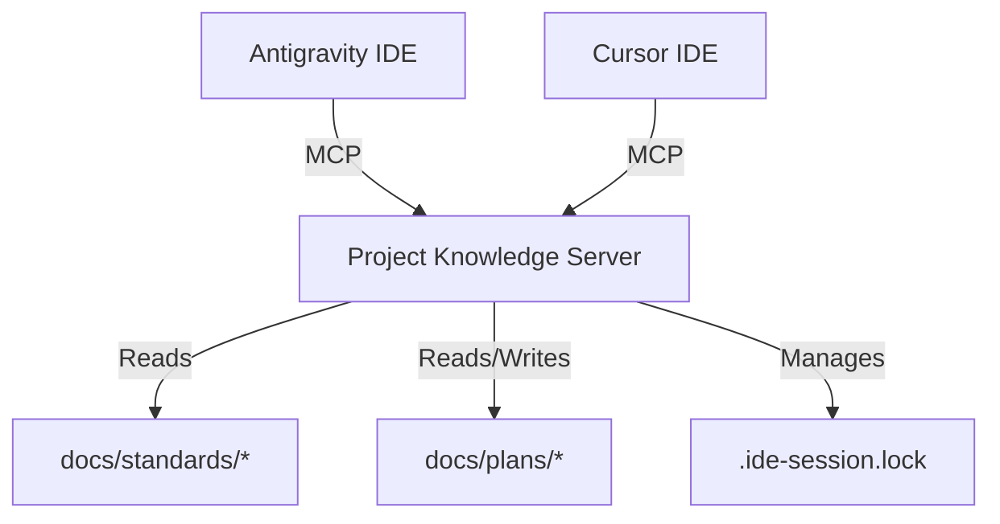

# MCP Architecture: Project Knowledge Server

**Status**: Draft / Design Phase
**Goal**: Create a unified "Project Brain" accessible by both Antigravity and Cursor via MCP.

## Overview

The **Project Knowledge Server** is a custom MCP (Model Context Protocol) server running locally. It acts as the single source of truth for:

1. **Project Standards** (The "Constitution")
2. **Active State** (Plans, Tasks, Session Locks)
3. **Operational Tools** (Switching sessions, deploying modules)

## Architecture

## Resources (Read-Only)

### `project://standards`

- **Source**: `docs/truth/all-code-truth.mdc`
- **Description**: The full text of the project constitution.
- **Usage**: Agents read this at session start to load context.

### `project://state/plan`

- **Source**: `docs/plans/active-plan.md`
- **Description**: The current implementation plan.

### `project://state/task`

- **Source**: `docs/plans/active-task.md`
- **Description**: The current task checklist.

## Tools (Executable)

### `switch_session(target: "antigravity" | "cursor")`

- **Description**: Safely switches the active IDE session.
- **Logic**:
  1. Checks git status (must be clean).
  2. Updates `.ide-session.lock`.
  3. Returns instructions to the user (e.g., "Close current window").

### `sync_artifacts(task_content: string, plan_content: string)`

- **Description**: Updates the shared plan/task files from an agent's internal state.
- **Usage**: Antigravity calls this to "publish" its brain state to Cursor.

## Implementation Roadmap

1. **Setup**: Initialize `scripts/mcp-server.ts` using `@modelcontextprotocol/sdk`.
2. **Resources**: Implement file readers for standards and plans.
3. **Tools**: Implement the `switch_session` logic (porting from `switch-ide.sh`).
4. **Integration**: Configure `.cursor/mcp.json` (or equivalent) and Antigravity settings.
